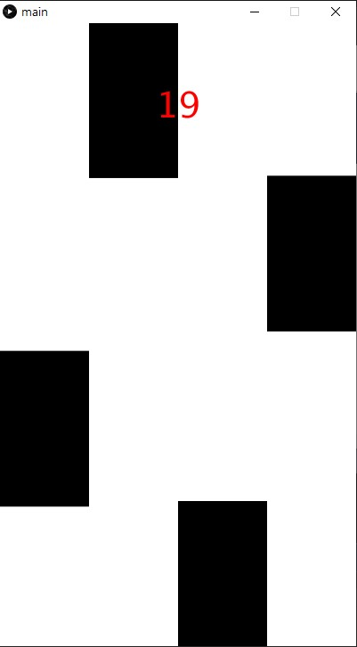

# Piano-Tiles-Processing
Piano tiles mockup using processing.

## Prerequisite
1. [Processing 3](https://processing.org/)

## Running
1. Open `main/main.pde` using Processing
2. Press Run or `ctrl+R`

## How to Play
- Press black tiles before it reaches the bottom

## Acknowledgement
This game meant to be played on android.

To run on android, change from "Java" mode to "Android" mode on top right of prcessing window.